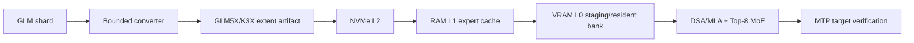

# GLM5X

### A GLM-5.x out-of-core inference engine for a single consumer PC

GLM5X is a correctness-first runtime and storage project for running GLM-5.x on a machine with a 16 GB consumer GPU, large system RAM, and NVMe storage. It is designed around the model's sparse MoE routing, DSA/MLA attention, MTP speculative decoding, and expert-major verification rather than treating the workload as a dense model with a generic cache.

> **Status:** bootstrap in progress. The repository contains the migrated K3X storage/cache foundation and a GLM-5.x model descriptor. No GLM weights are bundled, and no throughput number is claimed yet.

## What is here now

- K3X-compatible aligned checkpoint extents, checksums, and resumable streaming conversion core.
- Three-tier residency interfaces for VRAM, system RAM, and NVMe.
- Deadline-aware prefetch, task/session profiles, expert cache policies, and benchmark schemas inherited from K3X.
- GLM descriptor validation for DSA, 256 routed experts, Top-8 routing, shared experts, and MTP metadata.
- A `glm5x-convert` entry point that currently wraps the proven storage converter while the GLM tensor manifest is being added.
- Strict separation between implemented code, experiments, proposals, and measurements.

## What is not claimed

- GLM-5.2 or GLM-5.3 weights are not included.
- The GLM reference graph and CUDA fast path are not complete.
- DSpark/MTP, expert-major batching, proxy routing, or adaptive quality modes are not yet measured on the target PC.
- Synthetic or bounded fixtures are not evidence of full-model throughput.

## Design



The storage ABI is model-neutral. Model descriptors, tensor manifests, calibration profiles, expert transition statistics, and MTP acceptance profiles are model-specific. This is what allows GLM-5.2 to be used as the current development checkpoint and GLM-5.3 to replace it later without rewriting the cache and storage pipeline.

## Quick start

The bootstrap suite uses the existing project environment when available.

```powershell
# From the repository root
$py = "C:\path\to\python.exe"
& $py -m pytest tests/python/test_glm5x_model_descriptor.py tests/python/test_glm5x_cli.py -q
```

Build the portable C++ runtime on Linux or WSL2 with CMake and Ninja.

```bash
cmake -S . -B build -G Ninja -DK3X_ENABLE_CUDA=OFF
cmake --build build
ctest --test-dir build --output-on-failure
```

The converter CLI is intentionally data-free in this milestone.

```bash
python -m glm5x_converter.cli --help
```

## Roadmap

1. GLM-5.2 descriptor, manifest, and tiny reference graph.
2. GLM-5.2 synthetic checkpoint round-trip and greedy token parity.
3. Exact CPU runtime and profiler.
4. CUDA DSA/MLA and Top-8 MoE backend.
5. Three-tier asynchronous expert pipeline.
6. MTP/AURORA and DSpark-compatible expert-major verification.
7. Mixed quantization, calibration, and quality modes.
8. GLM-5.3 checkpoint swap validation when the official weights are released.

## Evidence policy

Every optimization keeps a reference mode. Every performance result records the commit, hardware, model identity, context, cache state, I/O bytes, and quality result in `BENCHMARKS.md`. Estimates and targets are labeled as such and are never presented as measurements.

## Repository map

| Path | Role |
| --- | --- |
| `reference/glm5x_ref` | GLM descriptor and reference graph boundary |
| `converter/k3x_converter` | Reused storage-format implementation |
| `converter/glm5x_converter` | GLM5X-facing converter CLI |
| `runtime/` | C++20 portable runtime and optional CUDA backend |
| `tests/` | Python and C++ correctness gates |
| `docs/superpowers/specs` | Accepted architectural design |
| `docs/superpowers/plans` | Bootstrap implementation plan |
| `checklist.md` | Current work checklist |
| `context-notes.md` | Decisions and continuity notes |

## License

Apache-2.0. See [LICENSE](LICENSE).

