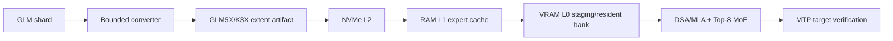

# GLM5X

### A GLM-5.x out-of-core inference engine for a single consumer PC

GLM5X is a correctness-first runtime and storage project for running GLM-5.x on a machine with a 16 GB consumer GPU, large system RAM, and NVMe storage. It is designed around the model's sparse MoE routing, DSA/MLA attention, MTP speculative decoding, and expert-major verification rather than treating the workload as a dense model with a generic cache.

> **Status:** The exact GLM-5.2 reference graph, resumable converter, and CUDA expert sublayer boundaries are implemented and tested. The local full checkpoint is now materialized as `282` verified `.k3x` artifacts; lazy assembly indexes `59,585` tensors and `19,456` complete experts. The first full exact BF16 natural Top-16 gate on an RTX 5080 measured `0.003304` decode tok/s, `0.003258` prefill tok/s, `609.621 s` TTFT, and `79.763 GB` of logical artifact reads per token. This is a correctness/storage baseline, not an optimized result. The cached two-token run also measured `0.003271` tok/s with zero expert-cache hits because the current cache capacities do not retain the working set. The next performance milestone is exact resident trunk reuse plus layer-aware pinned/asynchronous staging; no quality-changing fast mode is enabled from these measurements. Public Linux correctness and CodeQL are green on `5dfe036`; no cloud or paid resource was used.

The current precision decision is explicit: official FP8, if supplied, is consumed as an interoperability/comparison artifact; the project’s optimization target is native Blackwell FP4. The new NVFP4 path is implemented and bounded-tested, but remains experimental/default-off until calibration and full-model quality gates pass.

## What is here now

- K3X-compatible aligned checkpoint extents, checksums, and resumable streaming conversion core.
- Three-tier residency interfaces for VRAM, system RAM, and NVMe.
- Deadline-aware prefetch, task/session profiles, expert cache policies, and benchmark schemas inherited from K3X.
- GLM descriptor validation for DSA, 256 routed experts, Top-8 routing, shared experts, and MTP metadata.
- `GLM5XTensorManifest` validation for safetensors shard maps and source byte totals before conversion.
- Official manifest role resolution for GLM indexer `full/shared` layers and `wk/wq_b/weights_proj/k_norm` tensor names without opening a shard.
- Header-only safetensors parity inspection for a bounded real GLM shard; names, shapes, and dtypes are checked without loading its 5.3 GB payload into RAM.
- Experimental `glm5x-convert convert-shard` streams one validated shard into aligned BF16 extents, emits a tensor-name sidecar, and resumes after a worker interruption through a source/config-fingerprinted ledger. Complete `gate_proj/up_proj/down_proj` triples receive `EXPT` directory records; partial role groups remain sidecar-only.
- `glm5x-convert assemble-experts` builds a copy-free cross-shard expert index. It records artifact-relative paths and exact tensor offsets/CRCs, so a later runtime can fetch one expert's three roles without merging multi-gigabyte payloads.
- The Python reference bundle loader rechecks artifact identity and role metadata before returning exact BF16 bytes. A bounded nonzero real-shard gate matched all three roles for layer 10 expert 0 byte-for-byte against the source safetensors tensor data.
- Bundle open now builds a per-artifact tensor-ID index, so repeated exact expert reads avoid a linear metadata scan while retaining extent, dtype, and CRC validation.
- Bundle admission is strict by default. The experimental lazy mode skips whole-artifact payload/root scans at open and verifies each selected tensor CRC on first read, so layer-at-a-time startup does not reread every cold shard.
- C++ `load_glm5x_bf16_expert` now consumes multiple shard readers, finds the three GLM roles by canonical tensor ID, verifies released dimensions and CRC32C, and returns exact host payloads. The first real 75 MiB host-load gate completed in 465 ms under WSL; this is not CUDA tok/s.
- `k3x_cuda_glm5x_real_expert_bench` now executes one real nonzero GLM expert through CUDA. The latest FP32 resident sample measured 271 µs warm median with CPU max error `8.38e-9`; cached BF16-rounded conversion measured 237 µs with half the resident weight bytes and remains experimental until model-quality checks.
- The same bridge supports a bounded multi-expert probe. Eight real layer-10 experts ran sequentially at 1.854 ms warm median in BF16 with 604 MB resident; FP32 exceeded the 1 GiB resident budget and incurred 3.02 GB of warm H2D over the sample.
- The real bridge now supports expert-major BF16 grid execution with `--tokens`. Eight layer-10 experts over four candidate tokens measured 1.759 ms per block (about 0.440 ms per candidate token), zero warm weight H2D, 604 MB resident, and 0.135% maximum relative CPU difference. This is still one FFN block, not model tok/s.
- The grid now accepts raw BF16 role bytes directly, avoiding FP32 materialization for non-reference experts. The same 8-expert/4-token probe measured 1.649 ms per block (about 0.412 ms per candidate token), 136 ms cold execution, zero warm weight H2D, 604 MB resident, and the same 0.135% maximum relative CPU difference.
- Expert-major pointer-array GEMM is now enabled for multi-expert BF16 grids. The latest isolated 8-expert/4-token probe measured 1.065 ms/block (about 0.266 ms/candidate), with four resident-grid GEMM/GLU launches per call and 576 bytes of pointer descriptors per call. Single-expert calls stay on the scalar grid because pointer batching is slower there.
- An opt-in BF16-output resident-grid mode now keeps gate/up/down intermediates in BF16 and halves the final device-to-host output bytes. On the same real 8-expert/4-token probe it measured 1.035 ms/block versus 1.091 ms with FP32 output in the paired rerun (about 5% faster), while maximum CPU-relative error rose to 0.317%; FP32 output remains the default.
- The real-grid benchmark accepts `--workspace-bytes N` for cublasLt tuning. A 64 MiB workspace reduced one paired FP32-output sample from 0.995 ms to 0.968 ms/block, while the same budget slowed the BF16-output sample; the default remains zero bytes.
- The raw BF16 backend now has a packed-input grid contract for expert-major schedulers. It keeps one pointer-array plan while each expert receives its own `[candidate][hidden]` slab, and the existing common-input API remains unchanged.
- `build_expert_major_packed_plan` prepares those slabs from token hidden states and exact route assignments. The route-index scatter remains explicit so adaptive Top-K and speculative verification cannot silently change semantics.
- `bucket_expert_major_packed_plan` groups ragged expert assignments by assignment count in stable first-use order, so the packed CUDA grid can run rectangular batches without padding while retaining source group indices for exact scatter.
- `scatter_expert_major_outputs` applies each retained router contribution and restores group outputs to token-major order on the reference side; CUDA remains responsible only for expert FFN slabs.
- `CudaBackend::raw_bf16_situ_mlp_expert_major` now consumes those buckets, dispatches the raw-BF16 grid, and applies the explicit weighted scatter. On five bounded real shards, a deterministic 8-group/10-assignment/2-token probe measured 1.380 ms/block versus 1.651 ms for common input. This is a bounded FFN scheduling result, not learned routing or model tok/s.
- `--input-mode learned-expert-major` now reads the real GLM-5.2 router and FP32 correction bias, selects natural Top-8 experts, and sends only that union to the same CUDA path. A two-token probe selected 15 experts and measured 1.906 ms/block with 0.0866% maximum CPU-relative difference under a 2 GiB resident budget. This is still an MoE/FFN block result, not full-model tok/s.
- `--input-mode learned-moe-layer` adds the real layer shared expert to that natural routed union. The two-token bounded MoE sublayer measured 2.155 ms/block with 0.0586% maximum CPU-relative difference; the four-token run measured 3.968 ms/block with 0.0430% difference. This remains a sublayer result, not full-model tok/s.
- `--device-accumulate 1` is an experimental learned-MoE switch that keeps bucket outputs on the device, accumulates weighted assignments into one token-major FP32 buffer, and performs one final D2H copy. Three repeated two-token samples had a median-of-runs of 1.992 ms versus 2.492 ms for the host-scatter baseline, with unchanged 0.0572% GPU/CPU relative error. The spread is material, so the default remains host scatter and this is not an end-to-end tok/s result.
- `--fuse-shared 1` is an additional experimental switch for `learned-moe-layer` that adds the shared expert's device output into the same accumulator. It requires `--device-accumulate 1` and FP32 output, and reduces the exact GLM5XACT two-token handoff from a 2.195 ms baseline median-of-runs to 1.986 ms in one 100-iteration sweep. The result is bounded MoE evidence only, so the default remains unchanged.
- The Python reference layer/model factories accept `execution_mode="expert_major"` for a parity-tested grouped `torch.bmm` experiment. On the real layer-10 partial bundle it measured 18.652 ms versus 21.670 ms for a four-token direct MoE sublayer, but 7.359 ms versus 5.584 ms for one token; its temporary stacked-weight allocation was about 1.97 GB. It is default-off and is not a full-model tok/s claim.
- The real-shard probe can compare `--input-mode common` with a deterministic `--input-mode sparse-packed` assignment pattern. The latter measured 0.966 ms/block versus 1.041 ms for common 2-token input in one 8-expert rerun; this is not learned routing or end-to-end tok/s.
- The portable C++ reader validates raw-BF16 `EXPT` staging records as well as native MXFP4 records. The bounded real-shard CUDA bridge now consumes those payloads; full-layer routing and quality validation are still pending.
- `glm5x-convert convert-shards` treats every manifest shard as an independently restartable unit, skips already verified artifacts, and leaves completed shards intact when a later shard fails.
- `glm5x-convert convert-shards --delete-source` verifies each finalized artifact, writes an atomic deletion marker, then removes only the source shard; retries can resume from the marker without retaining the full source checkpoint.
- `tools/stream_glm5x_checkpoint.py` performs resumable HTTP-range downloads from the public GLM-5.2 repository, converts one shard at a time, deletes only verified source shards, and assembles the bundle after all shards finish. It never requires the full checkpoint in RAM or VRAM.
- `tools/benchmark_glm5x_reference.py` measures a completed bundle with explicit token IDs and records prefill tok/s, TTFT, decode tok/s, generated tokens, cache/execution switches, and CUDA memory. It never fabricates a TPS result from bounded layer timings.
- The full-bundle gate accepts `--expert-load-workers N` to overlap exact selected-expert reads from K3X artifacts. The default `1` remains the serial correctness path until a real full-model I/O benchmark proves a benefit.
- Full-bundle JSON now records logical storage payload read calls/bytes separately for prefill and decode. These are file-read counters, not physical NVMe measurements when the host page cache is warm.
- The reference logits path prepares the FP32 LM head once per model/device, replaces the BF16 head after preparation, and reuses it across decode steps. This is an exact-path allocation reduction; its temporary conversion peak and final VRAM cost are measured separately and are not hidden as a TPS claim.
- `PERFORMANCE_MODEL.md` records the dimension-derived GLM-5.2 traffic bound separately from measured RTX 5080 results. The bound shows why resident mixed-precision trunk execution is required for the 10 tok/s target.
- The native runtime accepts `--l2-schedule deadline --l2-expert-workers N` for the C++ deadline loader. The default RuntimeSession value is `8`; direct scheduler tests retain the serial default, and same-key cache loads remain deduplicated while different keys can overlap.
- FP8 is retained only as an experimental comparison baseline. If an official GLM FP8 artifact is available, GLM5X should consume that artifact rather than replace it with a local quantizer; it is not the target precision for this project.
- The reference benchmark now exposes an experimental `--expert-precision mxfp4` path and fingerprinted `.pm4` sidecars. On one real layer-10 token, eight selected experts used `160,440,156` sidecar bytes (`26.56%` of the corresponding BF16 role bytes), preserved route IDs, and measured `16.36%` relative L2 error against BF16. The current implementation decodes to BF16 for reference correctness, so its `17.868 s` warm-sidecar time is not a speed claim; native Blackwell FP4 execution and calibration remain open.
- The reference benchmark now also exposes experimental Blackwell `--expert-precision nvfp4` and `--expert-precision nvfp4_gate_up` paths. NVFP4 stores E2M1 values with blocked FP8 E4M3 scales and uses the RTX 5080 `torch._scaled_mm` contract; `.pn4` and `.pgu` sidecars preserve the same source digest/CRC discipline. On the real layer-10 one-token gate, all-NVFP4 measured `5.2946 s` versus BF16 `4.5003 s` with `18.14%` relative L2 error, while routed gate/up-only NVFP4 measured `4.3504 s` versus BF16 `4.4513 s` with `12.60%` relative L2 error and equal routes. These are bounded layer measurements, not full-model tok/s; FP4 remains default-off pending calibration and final-logit quality.
- The reference benchmark also exposes an experimental CUDA TinyGEMM `--expert-precision int4` path. It packs BF16 expert projections on the GPU and can retain them in `--expert-device-cache-bytes`; cold packing is not a throughput claim and the exact BF16 path remains the default.
- The same INT4 path accepts `--expert-packed-cache-dir` for an optional fingerprint-bound `.pi4` sidecar. A layer-10 repeat probe fell from `18.1128 s` on sidecar creation to `1.1524 s` on a fresh process with `0` bundle-read bytes; this is a warm sublayer/storage result, not full-model tok/s.
- Exact expert reads now group the three co-located role extents under one K3X artifact open. A bounded layer-10 cold sample with four readers improved from `2.752 s` to `2.184 s`; this is not an end-to-end TPS result.
- `--expert-cache-bytes N` enables an exact host payload cache across layer loads and token forwards; `0` disables it. The monitor records both a cold run and an 8 GiB cached run without changing router decisions or quantization.
- `--expert-device-cache-bytes N` optionally retains decoded exact expert tensors on the target GPU; `0` disables it. The monitor uses 4 GiB only in the cached comparison and records residency/hit telemetry.
- `tools/monitor_glm5x_full_gate.sh` is a local-only coordinator helper. It waits for all source-deletion markers, performs lazy final bundle assembly, then runs separate cold 1-token and cached 2-token CUDA reference gates with crash-safe JSON outputs.
- The monitor uses `EXPERT_LOAD_WORKERS=16` by default for those full-gate CUDA runs because the bounded real probe improved through 16 readers; set the environment variable explicitly to reproduce another point. The general CLI default remains serial for correctness.
- The monitor is POSIX-`sh` compatible and declares its interpreter. It selects `/home/jolib/.venvs/k3x-m1/bin/python` in the local WSL CUDA setup, accepts `K3X_PYTHON` as an override, and falls back to `python3`/`python`; invoke it directly or with `sh tools/monitor_glm5x_full_gate.sh`.
- The first completed full-bundle gate is intentionally reported as a bottleneck baseline. The exact cold path reread `79,763,152,896` logical bytes per token, while the configured 8 GiB host/4 GiB device expert caches recorded zero hits. Do not interpret the baseline as the expected optimized TPS.
- The first full-model INT4-expert probe was also a rejection gate: with `trunk=int4`, `expert=int4`, natural Top-8, and no packed expert cache it measured `0.002830 tok/s`, `45,298,483,200` logical expert bytes/token, and `17,341,184,512` peak allocated VRAM bytes. This path is experimental and not a 10 tok/s solution.
- The stream also supports disjoint local workers with `--shard-start`, `--shard-end`, and `--no-assemble`; workers can convert separate ranges concurrently, followed by one final bundle assembly.
- Stream completion reuses each shard's strict conversion gate for bundle indexing, so final assembly does not rescan every payload. Strict bundle admission is still the runtime default.
- A GLM-5.2-shaped CUDA expert benchmark for hidden size 6144 and expert intermediate size 2048, including 1/2/4/8-token expert-major batching.
- Exact resident MXFP4 reuse for CUDA expert-major batches; warm batches avoid re-uploading packed/scales weights.
- The reference layer now has opt-in MXFP4 and NVFP4 encoders with deterministic blocked-scale selection. On a real layer-10 expert, three BF16 projections shrink from `75,497,472` to about `20,054,016` bytes (`26.56%`), but the uncalibrated all-FP4 FFN output drift remains too high for a default. The native NVFP4 route is therefore a measured Blackwell kernel/storage experiment, not a quality-mode claim.
- The reference benchmark now exposes explicit reduced-routing and shared cold-expert proxy switches. A real four-token Top-4 shared proxy cut the bounded layer time from `12.4373 s` to `5.0434 s`, but relative L2 drift was `0.8121`; therefore it remains experimental and default-off.
- The fingerprinted sidecar supports CUDA TinyGEMM INT4 (`.pi4`), comparison-only row-scaled E4M3 FP8 (`.pf8`), and experimental reference MXFP4 (`.pm4`) records. None is enabled by default or promoted to a quality mode from a bounded layer result.
- Opt-in resident BF16 dequantized expert-grid path using cublasLt; exact BF16 remains the correctness default, while MXFP4/NVFP4 remain experimental. Historical bounded samples measured 2.58 ms/block versus 5.39 ms native, and the latest rerun measured 4.386 ms versus 5.511 ms native. Both used about 604 MB instead of 160 MB for resident selected weights; neither is an end-to-end tok/s claim.
- The shaped benchmark can compare a deterministic nonzero packed pattern against a native GPU reference with `--pattern nonzero`; this is numerical parity evidence, not a GLM quality score.
- CPU/reference `GLM5XDSAIndexer` and `GLM5XDSAState` now bind explicit query/key projections and descriptor index metadata to compressed KV blocks, exact top-k refresh, and an explicit stale fast-refresh experiment; its 600k/1M figures are formula-only.
- An official-shape `GLM5XOfficialDSAIndexer` reference now implements `wq_b`, `wk`, LayerNorm, optional interleaved indexer RoPE, `weights_proj`, ReLU score aggregation, causal masking, and Top-K selection. It can load only the five indexer tensors needed from a safetensors shard; it does not load the full checkpoint.
- `GLM5XLayer10MoEReference` implements the official GLM routed/shared SwiGLU boundary for layer 10, including sigmoid router scores, exact Top-8 selection, shared-expert addition, and lazy exact raw-BF16 expert loading from the five-shard bundle. A cold-to-cached smoke forward selected 15 unique experts and produced identical `[2, 6144]` BF16 outputs; this is a reference-layer result, not model quality or tok/s.
- `GLM5XDecoderModelReference` composes synthetic or bundle-backed decoder layers with final RMSNorm and an LM head. Its prompt-prefill and one-token state reuse produce matching logits and greedy token sequences in the CPU reference test; real all-layer checkpoint loading and CUDA final-logit execution remain pending.
- The reference MLA has an opt-in `--sparse-topk-attention` path that gathers only DSA-selected compressed KV positions. A real context-16,385 layer-10 probe measured `12.154 ms` dense versus `2.040 ms` sparse with `0.0278%` relative L2 drift; the dense path remains default until full-model quality and TPS are measured.
- `GLM5XDecoderModelReference.from_layer_loader` requests one decoder layer at a time, preserving only per-layer MLA/DSA recurrent state between calls. This is the reference-side contract for streaming 78 layers without full-model layer residency; real shard admission and async overlap are still pending.
- `GLM5XDecoderModelReference.from_bundle` builds that provider directly from the official GLM-5.2 config, selecting dense versus sparse MLP layers and nearest preceding shared-indexer tensors. Bounded probes can inject head tensors while exercising real decoder-layer payloads; full-model generation still requires every shard.
- The same layer loader has an opt-in bounded LRU for validated trunk layer objects. In the two-layer regression, two forwards made two loader calls with capacity 2 instead of four; capacity 0 retains the strict no-cache behavior.
- `GLM5XDecoderLayerReference.bundle_layer_loader` reuses one validated cross-shard bundle reader and tensor map across layer requests, while selected expert roles remain lazy and CRC-checked.
- The reference loader supports GLM-5.2's first three dense MLP layers through an explicit `mlp_type="dense"` path. It applies the official SwiGLU computation, preserves the layer output contract with an empty routing record, and does not admit expert payloads; sparse MoE remains the default.
- CPU/reference TurboQuant-style KV cache with asymmetric K/V bits and 600k–1M capacity arithmetic. This does not compress model weights and is not yet a CUDA performance path.
- A `glm5x-convert` entry point that wraps the proven storage converter while model-specific extent roles are completed.
- Strict separation between implemented code, experiments, proposals, and measurements.

## What is not claimed

- GLM-5.2 or GLM-5.3 weights are not included.
- The GLM reference graph and CUDA fast path are not complete.
- DSpark/MTP acceptance, proxy routing, adaptive quality modes, and end-to-end RTX 5080 throughput are not yet measured on the target PC. Expert-major batching and the BF16 grid are measured only as bounded CUDA layer paths, although their resident weight-reuse contracts are tested.
- Synthetic or bounded fixtures are not evidence of full-model throughput.

## Design



The storage ABI is model-neutral. Model descriptors, tensor manifests, calibration profiles, expert transition statistics, and MTP acceptance profiles are model-specific. This is what allows GLM-5.2 to be used as the current development checkpoint and GLM-5.3 to replace it later without rewriting the cache and storage pipeline.

## Quick start

The bootstrap suite uses the existing project environment when available.

```powershell
# From the repository root
$py = "C:\path\to\python.exe"
& $py -m pytest tests/python/test_glm5x_model_descriptor.py tests/python/test_glm5x_cli.py -q
```

Build the portable C++ runtime on Linux or WSL2 with CMake and Ninja.

```bash
cmake -S . -B build -G Ninja -DK3X_ENABLE_CUDA=OFF
cmake --build build
ctest --test-dir build --output-on-failure
```

The converter CLI is intentionally data-free in this milestone.

```bash
python -m glm5x_converter.cli --help
```

After a config, safetensors index, and one local shard are available, the bounded experimental writer is invoked as follows. It does not download missing shards.

```bash
python -m glm5x_converter.cli convert-shard \
  model-00001-of-00282.safetensors build/first-shard.k3x \
  --config config.json --index model.safetensors.index.json \
  --shard-name model-00001-of-00282.safetensors
```

For a local checkpoint directory, convert all manifest shards as independent `.k3x` artifacts. The command never downloads missing files and does not require the complete checkpoint to fit in RAM.

```bash
python -m glm5x_converter.cli convert-shards \
  /data/glm-5.2 /data/glm-5.2-k3x \
  --config /data/glm-5.2/config.json \
  --index /data/glm-5.2/model.safetensors.index.json
```

For a local full-checkpoint materialization, use the resumable one-shard-at-a-time driver. Keep the source and output directories separate. `--dry-run` only queries repository metadata.

```bash
PYTHONPATH=reference:converter:. python tools/stream_glm5x_checkpoint.py \
  --source-dir /data/glm-5.2-source \
  --output-dir /data/glm-5.2-k3x \
  --bundle /data/glm-5.2-k3x/glm5x-experts-full.json
```

The reference bundle/model factories accept `device="cuda"` when CUDA is available. This is a device-staging and parity boundary, not yet a complete CUDA decoder or throughput claim.

Each shard writes `<output>.partial` and `<output>.resume.json` while it is active. A retry validates the source SHA-256, converter/configuration fingerprint, canonical extent order, source CRC, and partial-file CRC before reusing completed extents. `--stop-after-tensors N` is available on `convert-shard` for crash/restart testing; it is not a production performance mode.

On the RTX 5080 WSL build, the bounded expert-grid comparison is explicit about its execution mode.

```bash
./build-glm5x-cuda-wsl/k3x_cuda_glm5x_moe_bench \
  --mode grid --execution native --experts 8 --tokens 4 \
  --warmup 20 --iterations 100
./build-glm5x-cuda-wsl/k3x_cuda_glm5x_moe_bench \
  --mode grid --execution dequantized-bf16 --pattern nonzero \
  --experts 8 --tokens 4 --warmup 10 --iterations 30
```

The BF16 mode is experimental and can fall back to native MXFP4 when the configured resident budget cannot hold the dense trunk plus the selected BF16 experts.

## Roadmap

1. GLM-5.2 descriptor, manifest, and tiny reference graph. (Descriptor/manifest and bounded CUDA baseline are complete.)
2. TurboQuant reference KV parity and packed paged-KV contract. (Reference path is complete; packed CUDA storage is pending.)
3. GLM-5.2 DSA/indexer state and 600k/1M capacity smoke. (Official-shape CPU/reference indexer parity and a bounded real-shard weight-read gate are complete; main MLA, learned q-residual production path, and full quality parity are pending.)
4. Resumable multi-shard conversion and exact CPU runtime/profiler. (Independent shard conversion is implemented; exact runtime/profiler remains pending.)
5. CUDA DSA/MLA, Top-8 MoE, and compressed-KV kernels.
6. Three-tier asynchronous expert pipeline.
7. MTP/AURORA and DSpark-compatible expert-major verification.
8. Mixed weight quantization, calibration, and quality modes.
9. GLM-5.3 checkpoint swap validation when the official weights are released.

## Evidence policy

Every optimization keeps a reference mode. Every performance result records the commit, hardware, model identity, context, cache state, I/O bytes, and quality result in `BENCHMARKS.md`. Estimates and targets are labeled as such and are never presented as measurements.

## Repository map

| Path | Role |
| --- | --- |
| `reference/glm5x_ref` | GLM descriptor and reference graph boundary |
| `reference/glm5x_ref/turboquant.py` | CPU/reference compressed KV contract and capacity estimator |
| `converter/k3x_converter` | Reused storage-format implementation |
| `converter/glm5x_converter` | GLM5X-facing single- and multi-shard converter CLI |
| `runtime/` | C++20 portable runtime and optional CUDA backend |
| `tests/` | Python and C++ correctness gates |
| `docs/superpowers/specs` | Accepted architectural design |
| `docs/superpowers/plans` | Bootstrap implementation plan |
| `checklist.md` | Current work checklist |
| `context-notes.md` | Decisions and continuity notes |

## License

Apache-2.0. See [LICENSE](LICENSE).
