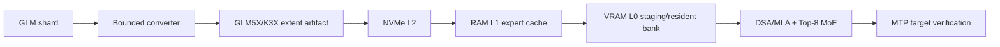

# GLM5X

### A GLM-5.x out-of-core inference engine for a single consumer PC

GLM5X is a correctness-first runtime and storage project for running GLM-5.x on a machine with a 16 GB consumer GPU, large system RAM, and NVMe storage. It is designed around the model's sparse MoE routing, DSA/MLA attention, MTP speculative decoding, and expert-major verification rather than treating the workload as a dense model with a generic cache.

> **Status:** GLM-5.2 shape and manifest boundary are implemented. No GLM weights are bundled. The repository has a real RTX 5080 bounded expert-kernel baseline, but no end-to-end tok/s number is claimed.

## What is here now

- K3X-compatible aligned checkpoint extents, checksums, and resumable streaming conversion core.
- Three-tier residency interfaces for VRAM, system RAM, and NVMe.
- Deadline-aware prefetch, task/session profiles, expert cache policies, and benchmark schemas inherited from K3X.
- GLM descriptor validation for DSA, 256 routed experts, Top-8 routing, shared experts, and MTP metadata.
- `GLM5XTensorManifest` validation for safetensors shard maps and source byte totals before conversion.
- A GLM-5.2-shaped CUDA expert benchmark for hidden size 6144 and expert intermediate size 2048, including 1/2/4/8-token expert-major batching.
- Exact resident MXFP4 reuse for CUDA expert-major batches; warm batches avoid re-uploading packed/scales weights.
- Opt-in resident BF16 dequantized expert-grid path using cublasLt; the native exact MXFP4 path remains the default. Historical bounded samples measured 2.58 ms/block versus 5.39 ms native, and the latest rerun measured 4.386 ms versus 5.511 ms native. Both used about 604 MB instead of 160 MB for resident selected weights; neither is an end-to-end tok/s claim.
- The shaped benchmark can compare a deterministic nonzero packed pattern against a native GPU reference with `--pattern nonzero`; this is numerical parity evidence, not a GLM quality score.
- CPU/reference `GLM5XDSAState` now binds descriptor index metadata to compressed KV blocks, exact top-k refresh, and an explicit stale fast-refresh experiment; its 600k/1M figures are formula-only.
- CPU/reference TurboQuant-style KV cache with asymmetric K/V bits and 600k–1M capacity arithmetic. This does not compress model weights and is not yet a CUDA performance path.
- A `glm5x-convert` entry point that wraps the proven storage converter while model-specific extent roles are completed.
- Strict separation between implemented code, experiments, proposals, and measurements.

## What is not claimed

- GLM-5.2 or GLM-5.3 weights are not included.
- The GLM reference graph and CUDA fast path are not complete.
- DSpark/MTP acceptance, proxy routing, adaptive quality modes, and end-to-end RTX 5080 throughput are not yet measured on the target PC. Expert-major batching and the BF16 grid are measured only as bounded CUDA layer paths, although their resident weight-reuse contracts are tested.
- Synthetic or bounded fixtures are not evidence of full-model throughput.

## Design



The storage ABI is model-neutral. Model descriptors, tensor manifests, calibration profiles, expert transition statistics, and MTP acceptance profiles are model-specific. This is what allows GLM-5.2 to be used as the current development checkpoint and GLM-5.3 to replace it later without rewriting the cache and storage pipeline.

## Quick start

The bootstrap suite uses the existing project environment when available.

```powershell
# From the repository root
$py = "C:\path\to\python.exe"
& $py -m pytest tests/python/test_glm5x_model_descriptor.py tests/python/test_glm5x_cli.py -q
```

Build the portable C++ runtime on Linux or WSL2 with CMake and Ninja.

```bash
cmake -S . -B build -G Ninja -DK3X_ENABLE_CUDA=OFF
cmake --build build
ctest --test-dir build --output-on-failure
```

The converter CLI is intentionally data-free in this milestone.

```bash
python -m glm5x_converter.cli --help
```

On the RTX 5080 WSL build, the bounded expert-grid comparison is explicit about its execution mode.

```bash
./build-glm5x-cuda-wsl/k3x_cuda_glm5x_moe_bench \
  --mode grid --execution native --experts 8 --tokens 4 \
  --warmup 20 --iterations 100
./build-glm5x-cuda-wsl/k3x_cuda_glm5x_moe_bench \
  --mode grid --execution dequantized-bf16 --pattern nonzero \
  --experts 8 --tokens 4 --warmup 10 --iterations 30
```

The BF16 mode is experimental and can fall back to native MXFP4 when the configured resident budget cannot hold the dense trunk plus the selected BF16 experts.

## Roadmap

1. GLM-5.2 descriptor, manifest, and tiny reference graph. (Descriptor/manifest and bounded CUDA baseline are complete.)
2. TurboQuant reference KV parity and packed paged-KV contract. (Reference path is complete; packed CUDA storage is pending.)
3. GLM-5.2 DSA/indexer state and 600k/1M capacity smoke. (Descriptor-shaped CPU/reference state is complete; learned indexer graph is pending.)
4. Exact CPU runtime and profiler.
5. CUDA DSA/MLA, Top-8 MoE, and compressed-KV kernels.
6. Three-tier asynchronous expert pipeline.
7. MTP/AURORA and DSpark-compatible expert-major verification.
8. Mixed weight quantization, calibration, and quality modes.
9. GLM-5.3 checkpoint swap validation when the official weights are released.

## Evidence policy

Every optimization keeps a reference mode. Every performance result records the commit, hardware, model identity, context, cache state, I/O bytes, and quality result in `BENCHMARKS.md`. Estimates and targets are labeled as such and are never presented as measurements.

## Repository map

| Path | Role |
| --- | --- |
| `reference/glm5x_ref` | GLM descriptor and reference graph boundary |
| `reference/glm5x_ref/turboquant.py` | CPU/reference compressed KV contract and capacity estimator |
| `converter/k3x_converter` | Reused storage-format implementation |
| `converter/glm5x_converter` | GLM5X-facing converter CLI |
| `runtime/` | C++20 portable runtime and optional CUDA backend |
| `tests/` | Python and C++ correctness gates |
| `docs/superpowers/specs` | Accepted architectural design |
| `docs/superpowers/plans` | Bootstrap implementation plan |
| `checklist.md` | Current work checklist |
| `context-notes.md` | Decisions and continuity notes |

## License

Apache-2.0. See [LICENSE](LICENSE).
